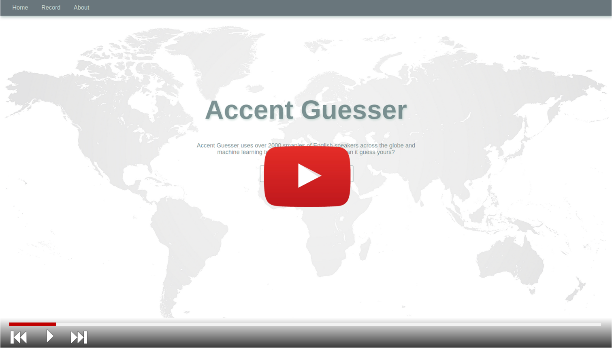
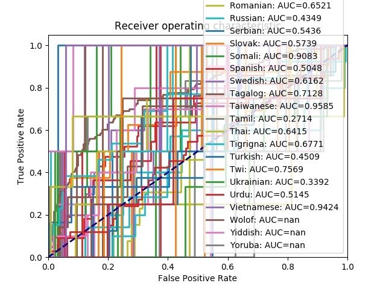

## Can We Guess Your First Language from English?

Based off of a dataset found from Kaggle (link below), we are training a convolutional neural network (CNN) to be able to detect the accent of a speaker reading a passage in English. Utilizing a graphical user interface (GUI), the user has the ability to record their voice and upload it to the GUI for it to be tested on the CNN, and then be able to see where the network guessed they were from. After this, the user has the option to indicate whether it was correct or not, and the CNN will be able to use these recordings as future datasets to train on.

## The Convolutional Magic of the Neural Network

Our Accent Guesser runs on a [convolutional neural network (CNN)](https://en.wikipedia.org/wiki/Convolutional_neural_network) using [Keras](https://keras.io/) and [Tensorflow](https://www.tensorflow.org/). After training on thousands of audio recordings from the [Speech Accent Archive](http://accent.gmu.edu/), the CNN developed a system of equations which, when fed audio data, should classify it based on the accent of the speaker. The training process works by labelling each recording with its accent, processing the data by multiplying it by a system of weights, which highlight and compare different features, and gradually reduce it to one of about 120 “classes” (in this case, accents). The error from this initial guess is calculated, and the system's weights are adjusted accordingly, and then the process is repeated until a sufficient level of accuracy is reached. We used the Panotti classifier from github user drscotthawley, which can be found [here](https://github.com/drscotthawley/panotti), but have modified it somewhat, and our changes can be found [here](https://github.com/JonahSpicher/NewClassifier).

This is all done in the background. As far as user interface goes, a [Flask](http://flask.pocoo.org/) based web-app acts as the front end. It records the user’s voice, then uses the CNN’s weights to guess their accent, presents that guess, and then asks for feedback. It stores their recording and correct accent in the training database to further train the accent guesser later.

## Hit Record

Before running the accent guesser on your system, follow the steps in the README.md in order to install the appropriate packages. Once these are installed, navigate to the accent guesser webpage by running web_app.py, and follow the instructions onscreen. In order to have the accent guesser take in your recording, you must start and stop your recording; it will then save to your computer. Using the browse button on the webpage, locate the file and upload it, and then have it guess!

The dataset can be found [here](https://www.kaggle.com/rtatman/speech-accent-archive)

## Results and Functionality

Here is a video of it in action:

Here is an ROC curve of the network in its current state. As you can see, it has a long way to go before we can call it a total success. As of right now, test accuracy is about 25%, which is largely a function of our very limited dataset. Expanding the dataset should up our accuracy and prevent overfitting. The ROC curve is a plot for each class of the number of false positives compared to the number of true positives. Ideally, these lines would be mostly at the top left area of the graph, and would definitely not be vertical or quite so chaotic.

## Acknowledgements

Many thanks to GitHub user drscotthawley for the usage of his [audio classifier](https://github.com/drscotthawley/panotti).
Thank you as well to Chris Wilson and Matt Diamond for the javascript providing in-browser [audio recording capabilities](https://webaudiodemos.appspot.com/AudioRecorder/index.html).
